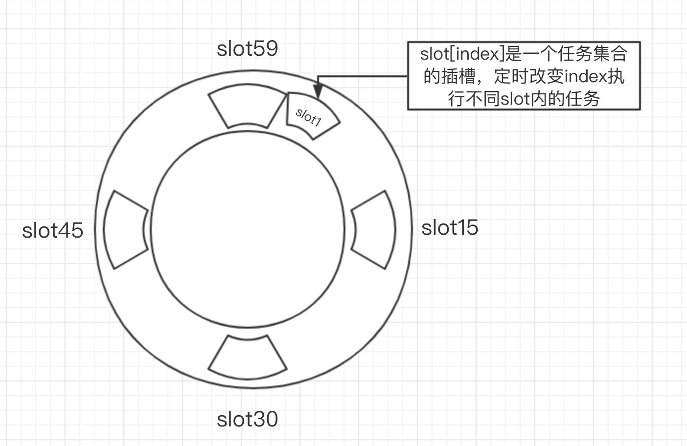

* content
{:toc}

#### 需求

最近做的一个项目，用户可以新建`待办事项`，需要在提醒时间定时推送消息
相似的场景：定时执行任务

#### 常见的方案

向表里插入任务，启动定时任务扫描表，到时间即执行
缺点：
1. 扫描时间间隔短，实效性好，但是耗性能，而且数据量大的时候更是不可行
2. 扫描时间间隔长，实效性差，而且数据量大的时候也是不可行
3. 扫描数据多且重复扫

如何保证效率的同时保证实效性是我们要解决的问题

#### 高效的定时消息设计

如图所示：
1. 使用环形队列: 根据需求实效性是1分钟，因此设计为0-59索引的插槽，每分钟执行该插槽内的任务
2. slot: 每个slot是任务的集合，使用一个字段`cycle`记录圈数，超过1小时的增加圈数，这样刚好是1小时对应60分钟，60个任务插槽
3. 定时: 启动一个定时任务，每隔一分钟修改索引`index`并执行该索引对应的slot内的任务，`cycle`不等于0，即减1，等于0即执行，并移除，`slot`就像时钟而`index`就像分针一样
4. 修改：更新任务对应插槽的位置

优点：
1. 无须扫表，轮询，效率高
2. 实效性好，可以根据需求精确到秒

#### 具体实现
> 此处不上代码了，说说计数栈

就此处`待办事项`定时提醒而言：
1. 新建待办事项，提醒时间换算成`cycle`(圈数)和`index`(slot)位置，存入`redis`(读写数据快)，具体执行任务的时候使用`id`取表里的具体信息
2. 修改，删除等，主要就是修改任务对应的`cycle`(圈数)和`index`(slot)位置
3. 想要知道任务在哪个`slot`内比较困难，因此在`redis`内存储`任务id`和`slot[index]`的map，便于检索
5. 启动定时任务一直改变`index`(slot)位置的值，执行相应slot内的任务集合（`cycle`等于0执行）
4. 推送消息，我们选择的是`socket`

> **PS:**新建任务的时候，需要使用当前的`index`(slot)位置作为起点计算该任务的位置
