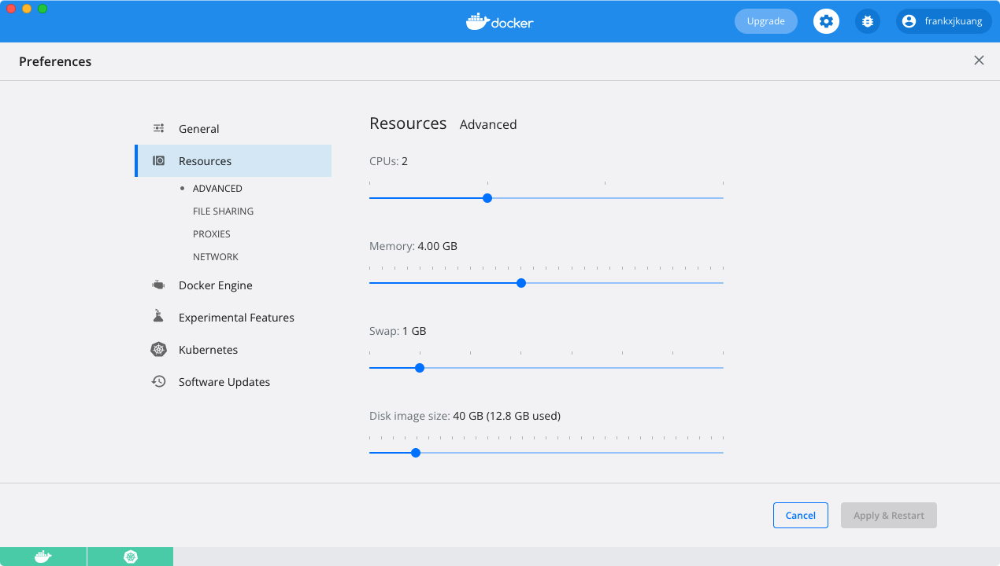
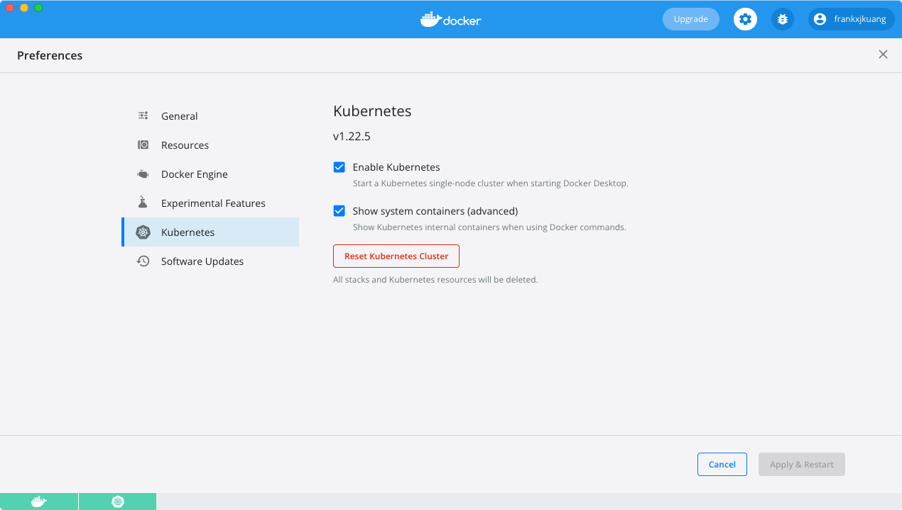
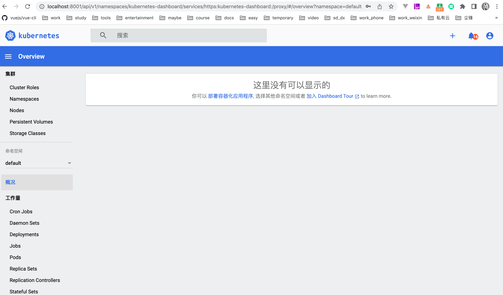

* content
{:toc}


> 记录一下使用客户端Docker启动Kubernetes
> [k8s的github仓库](https://github.com/kubernetes/kubernetes)
> 系统：MacOS
> Docker Desktop 4.6.1
> Kubernetes v1.22.5

文章大致实现如下：

1. 安装 Docker Desktop
2. 下载 K8s 镜像并启动
3. 下载 kubectl 工具
4. 启动 Dashboard

#### 安装 Docker Desktop
这一步不用多赘述，直接去官网根据自己的系统类型选择下载就行[docker-desktop](https://www.docker.com/products/docker-desktop/)

> PS：不通的版本内置的k8s版本可能不一样，我这里的版本是4.6.1

下载完成之后启动可以调整下偏好设置，我的配置大致如下：


修改 `Docker Engine` 的镜像地址配置，不多解释：

```
{
  "builder": {
    "gc": {
      "enabled": true,
      "defaultKeepStorage": "20GB"
    }
  },
  "features": {
    "buildkit": true
  },
  "experimental": false,
  "registry-mirrors": [
    "https://qsxqg6fg.mirror.aliyuncs.com",
    "https://reg-mirror.qiniu.com",
    "https://docker.mirrors.ustc.edu.cn",
    "https://dockerhub.azk8s.cn",
    "https://hub-mirror.c.163.com",
    "https://registry.docker-cn.com"
  ]
}
```

####  下载 K8s 镜像并启动
勾选 Enable Kubernetes，Apply&Restart


##### 如果一直处于starting状态，无法正常使用

原因是：启用Kubernetes功能，Docker需要从镜像仓库拉取Kubernetes相关镜像。

由于国内访问Docker Hub网速太慢，镜像无法成功拉取，导致Kubernetes一直处于starting状态。

##### 解决办法
步骤1：将库`https://github.com/maguowei/k8s-docker-for-mac`的代码下载至本地，可直接在终端中执行下面的命令：

```
git clone https://github.com/maguowei/k8s-docker-for-mac.git
```

步骤2：执行根目录下load_images.sh脚本即可正常下载镜像：

```
sh load_images.sh
```

之后便可以正常启动了

#### 下载 kubectl 工具
根据你电脑的操作系统，从 github 上直接下载指定平台版本的 kubectl。

参考 Desktop Kubernetes 的版本下载：
[Downloads for v1.22.5](https://github.com/kubernetes/kubernetes/blob/master/CHANGELOG/CHANGELOG-1.22.md#v1225)


下载后解压 kubectl 到某个目录下。然后打开终端命令行，进入这个目录，执行以下脚本，将其变更为可执行命令，同时移动到系统特定目录下。

对于 macOS 版本，下载后解压 kubectl 文件到 /usr/local/bin 目录下（以 amd64 版本为例）

$ tar zxvf kubernetes-client-darwin-amd64.tar.gz
$ cd ./kubernetes/client/bin
$ chmod +x kubectl && mv kubectl /usr/local/bin/kubectl
对于 Windows 版本，下载后解压 kubectl.exe 文件到 C:\Windows\System32 目录下

我们可以看下 kubectl 的版本号：

```
kubectl version

Client Version: version.Info{Major:"1", Minor:"22", GitVersion:"v1.22.5", GitCommit:"5c99e2ac2ff9a3c549d9ca665e7bc05a3e18f07e", GitTreeState:"clean", BuildDate:"2021-12-16T08:38:33Z", GoVersion:"go1.16.12", Compiler:"gc", Platform:"darwin/amd64"}
Server Version: version.Info{Major:"1", Minor:"22", GitVersion:"v1.22.5", GitCommit:"5c99e2ac2ff9a3c549d9ca665e7bc05a3e18f07e", GitTreeState:"clean", BuildDate:"2021-12-16T08:32:32Z", GoVersion:"go1.16.12", Compiler:"gc", Platform:"linux/amd64"}
```

ok到此安装完成

#### 启动 Dashboard

> [Dashboard github仓库](https://github.com/kubernetes/dashboard)

下载 Dashboard 镜像

```
docker pull kubernetesui/dashboard:v2.4.0
docker pull kubernetesui/metrics-scraper:v1.0.7
```

使用 yaml 文件启动服务

```
kubectl apply -f https://raw.githubusercontent.com/kubernetes/dashboard/v2.5.1/aio/deploy/recommended.yaml
```

> 如果出现由于读文件失败的情况可以在本地创建一个recommended.yaml文件
```
# Copyright 2017 The Kubernetes Authors.
#
# Licensed under the Apache License, Version 2.0 (the "License");
# you may not use this file except in compliance with the License.
# You may obtain a copy of the License at
#
#     http://www.apache.org/licenses/LICENSE-2.0
#
# Unless required by applicable law or agreed to in writing, software
# distributed under the License is distributed on an "AS IS" BASIS,
# WITHOUT WARRANTIES OR CONDITIONS OF ANY KIND, either express or implied.
# See the License for the specific language governing permissions and
# limitations under the License.

apiVersion: v1
kind: Namespace
metadata:
  name: kubernetes-dashboard

---

apiVersion: v1
kind: ServiceAccount
metadata:
  labels:
    k8s-app: kubernetes-dashboard
  name: kubernetes-dashboard
  namespace: kubernetes-dashboard

---

kind: Service
apiVersion: v1
metadata:
  labels:
    k8s-app: kubernetes-dashboard
  name: kubernetes-dashboard
  namespace: kubernetes-dashboard
spec:
  ports:
    - port: 443
      targetPort: 8443
  selector:
    k8s-app: kubernetes-dashboard

---

apiVersion: v1
kind: Secret
metadata:
  labels:
    k8s-app: kubernetes-dashboard
  name: kubernetes-dashboard-certs
  namespace: kubernetes-dashboard
type: Opaque

---

apiVersion: v1
kind: Secret
metadata:
  labels:
    k8s-app: kubernetes-dashboard
  name: kubernetes-dashboard-csrf
  namespace: kubernetes-dashboard
type: Opaque
data:
  csrf: ""

---

apiVersion: v1
kind: Secret
metadata:
  labels:
    k8s-app: kubernetes-dashboard
  name: kubernetes-dashboard-key-holder
  namespace: kubernetes-dashboard
type: Opaque

---

kind: ConfigMap
apiVersion: v1
metadata:
  labels:
    k8s-app: kubernetes-dashboard
  name: kubernetes-dashboard-settings
  namespace: kubernetes-dashboard

---

kind: Role
apiVersion: rbac.authorization.k8s.io/v1
metadata:
  labels:
    k8s-app: kubernetes-dashboard
  name: kubernetes-dashboard
  namespace: kubernetes-dashboard
rules:
  # Allow Dashboard to get, update and delete Dashboard exclusive secrets.
  - apiGroups: [""]
    resources: ["secrets"]
    resourceNames: ["kubernetes-dashboard-key-holder", "kubernetes-dashboard-certs", "kubernetes-dashboard-csrf"]
    verbs: ["get", "update", "delete"]
    # Allow Dashboard to get and update 'kubernetes-dashboard-settings' config map.
  - apiGroups: [""]
    resources: ["configmaps"]
    resourceNames: ["kubernetes-dashboard-settings"]
    verbs: ["get", "update"]
    # Allow Dashboard to get metrics.
  - apiGroups: [""]
    resources: ["services"]
    resourceNames: ["heapster", "dashboard-metrics-scraper"]
    verbs: ["proxy"]
  - apiGroups: [""]
    resources: ["services/proxy"]
    resourceNames: ["heapster", "http:heapster:", "https:heapster:", "dashboard-metrics-scraper", "http:dashboard-metrics-scraper"]
    verbs: ["get"]

---

kind: ClusterRole
apiVersion: rbac.authorization.k8s.io/v1
metadata:
  labels:
    k8s-app: kubernetes-dashboard
  name: kubernetes-dashboard
rules:
  # Allow Metrics Scraper to get metrics from the Metrics server
  - apiGroups: ["metrics.k8s.io"]
    resources: ["pods", "nodes"]
    verbs: ["get", "list", "watch"]

---

apiVersion: rbac.authorization.k8s.io/v1
kind: RoleBinding
metadata:
  labels:
    k8s-app: kubernetes-dashboard
  name: kubernetes-dashboard
  namespace: kubernetes-dashboard
roleRef:
  apiGroup: rbac.authorization.k8s.io
  kind: Role
  name: kubernetes-dashboard
subjects:
  - kind: ServiceAccount
    name: kubernetes-dashboard
    namespace: kubernetes-dashboard

---

apiVersion: rbac.authorization.k8s.io/v1
kind: ClusterRoleBinding
metadata:
  name: kubernetes-dashboard
roleRef:
  apiGroup: rbac.authorization.k8s.io
  kind: ClusterRole
  name: kubernetes-dashboard
subjects:
  - kind: ServiceAccount
    name: kubernetes-dashboard
    namespace: kubernetes-dashboard

---

kind: Deployment
apiVersion: apps/v1
metadata:
  labels:
    k8s-app: kubernetes-dashboard
  name: kubernetes-dashboard
  namespace: kubernetes-dashboard
spec:
  replicas: 1
  revisionHistoryLimit: 10
  selector:
    matchLabels:
      k8s-app: kubernetes-dashboard
  template:
    metadata:
      labels:
        k8s-app: kubernetes-dashboard
    spec:
      containers:
        - name: kubernetes-dashboard
          image: kubernetesui/dashboard:v2.0.0
          imagePullPolicy: Always
          ports:
            - containerPort: 8443
              protocol: TCP
          args:
            - --auto-generate-certificates
            - --namespace=kubernetes-dashboard
            # Uncomment the following line to manually specify Kubernetes API server Host
            # If not specified, Dashboard will attempt to auto discover the API server and connect
            # to it. Uncomment only if the default does not work.
            # - --apiserver-host=http://my-address:port
          volumeMounts:
            - name: kubernetes-dashboard-certs
              mountPath: /certs
              # Create on-disk volume to store exec logs
            - mountPath: /tmp
              name: tmp-volume
          livenessProbe:
            httpGet:
              scheme: HTTPS
              path: /
              port: 8443
            initialDelaySeconds: 30
            timeoutSeconds: 30
          securityContext:
            allowPrivilegeEscalation: false
            readOnlyRootFilesystem: true
            runAsUser: 1001
            runAsGroup: 2001
      volumes:
        - name: kubernetes-dashboard-certs
          secret:
            secretName: kubernetes-dashboard-certs
        - name: tmp-volume
          emptyDir: {}
      serviceAccountName: kubernetes-dashboard
      nodeSelector:
        "kubernetes.io/os": linux
      # Comment the following tolerations if Dashboard must not be deployed on master
      tolerations:
        - key: node-role.kubernetes.io/master
          effect: NoSchedule

---

kind: Service
apiVersion: v1
metadata:
  labels:
    k8s-app: dashboard-metrics-scraper
  name: dashboard-metrics-scraper
  namespace: kubernetes-dashboard
spec:
  ports:
    - port: 8000
      targetPort: 8000
  selector:
    k8s-app: dashboard-metrics-scraper

---

kind: Deployment
apiVersion: apps/v1
metadata:
  labels:
    k8s-app: dashboard-metrics-scraper
  name: dashboard-metrics-scraper
  namespace: kubernetes-dashboard
spec:
  replicas: 1
  revisionHistoryLimit: 10
  selector:
    matchLabels:
      k8s-app: dashboard-metrics-scraper
  template:
    metadata:
      labels:
        k8s-app: dashboard-metrics-scraper
      annotations:
        seccomp.security.alpha.kubernetes.io/pod: 'runtime/default'
    spec:
      containers:
        - name: dashboard-metrics-scraper
          image: kubernetesui/metrics-scraper:v1.0.4
          ports:
            - containerPort: 8000
              protocol: TCP
          livenessProbe:
            httpGet:
              scheme: HTTP
              path: /
              port: 8000
            initialDelaySeconds: 30
            timeoutSeconds: 30
          volumeMounts:
          - mountPath: /tmp
            name: tmp-volume
          securityContext:
            allowPrivilegeEscalation: false
            readOnlyRootFilesystem: true
            runAsUser: 1001
            runAsGroup: 2001
      serviceAccountName: kubernetes-dashboard
      nodeSelector:
        "kubernetes.io/os": linux
      # Comment the following tolerations if Dashboard must not be deployed on master
      tolerations:
        - key: node-role.kubernetes.io/master
          effect: NoSchedule
      volumes:
        - name: tmp-volume
          emptyDir: {}
```

启动服务

```
kubectl apply -f recommended.yaml
```

成功之后启动代理

```
# --port 可以指定端口
# kubectl proxy --port="9999"
kubectl proxy
```

查看 token

```
kubectl -n kube-system describe secret default| awk '$1=="token:"{print $2}'
```

访问网页界面地址 `http://localhost:8001/api/v1/namespaces/kubernetes-dashboard/services/https:kubernetes-dashboard:/proxy/#/overview?namespace=default` ，如下，登录 token 参考上一步：



ok，k8s已经在本机上run起来了，下一篇文章我们在k8s中部署一个应用程序


#### 参考文档

- https://github.com/AliyunContainerService/k8s-for-docker-desktop
- https://github.com/kubernetes/kubernetes
- https://kubernetes.io/docs/home/