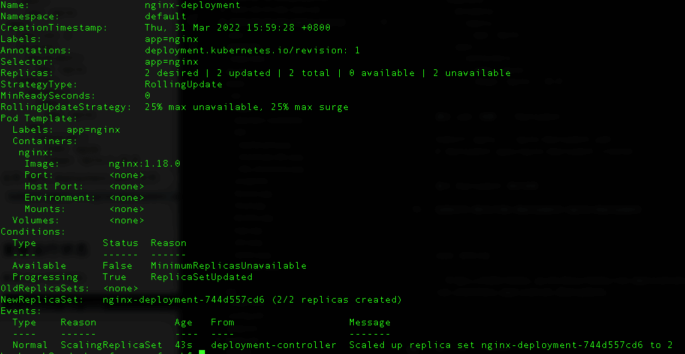

* content
{:toc}

目标：
- 创建 nginx deployment
- 更新、查看deployment
- 创建 nginx service

#### 创建 Deployment

创建 `nginx-deployment.yaml` 文件：
```
apiVersion: apps/v1
kind: Deployment
metadata:
  name: nginx-deployment
  labels:
    app: nginx
spec:
  replicas: 2
  selector:
    matchLabels:
      app: nginx
  template:
    metadata:
      labels:
        app: nginx
    spec:
      containers:
      - name: nginx
        image: nginx:1.18.0
```

通过 yaml 创建一个 Deployment
```
kubectl apply -f nginx-deployment.yaml
# deployment.apps/nginx-deployment created
```

显示 Deployment 相关信息
```
kubectl describe deployment nginx-deployment
```
信息如下：


查看 Deployment 创建的 Pods
```
kubectl get pods -l app=nginx

# NAME                                READY   STATUS    RESTARTS   AGE
# nginx-deployment-744d557cd6-tdblc   1/1     Running   0          3m
# nginx-deployment-744d557cd6-tttmg   1/1     Running   0          3m
```

查看某个 Pod 信息
```
# kubectl describe pod <pod-name>
kubectl describe pod nginx-deployment-744d557cd6-tdblc
```

#### 更新 yaml

比如将 Pod 调整为4
```
...
replicas: 2 -> 4
...
```

应用新的 yaml 文件
```
kubectl apply -f nginx-deployment.yaml
```

查看 Pods 
```
kubectl get pods -l app=nginx

# NAME                                READY   STATUS    RESTARTS   AGE
# nginx-deployment-744d557cd6-cwrbr   1/1     Running   0          16s
# nginx-deployment-744d557cd6-skqt6   1/1     Running   0          16s
# nginx-deployment-744d557cd6-tdblc   1/1     Running   0          9m27s
# nginx-deployment-744d557cd6-tttmg   1/1     Running   0          9m27s
```

查看部署情况
```
kubectl get deployment
# NAME               READY   UP-TO-DATE   AVAILABLE   AGE
# nginx-deployment   4/4     4            4           13m
```

其它参数调整类似

#### 删除 Deployment
```
# kubectl delete deployment <deployment-name>
kubectl delete deployment nginx-deployment
```

#### 创建 nginx service

创建 yaml 文件
```
apiVersion: v1
kind: Service
metadata:
  name: nginx-service
  labels:
    app: nginx
spec:
  selector:
    app: nginx
  ports:
  - name: nginx-port
    protocol: TCP
    port: 80
    nodePort: 30000
    targetPort: 80
  type: NodePort
```  

应用
```
kubectl apply -f nginx-service.yaml
# service/nginx-service created
```

查看 service 的运行情况
```
# kubectl get services -o wide <service-name>
kubectl get services -o wide 

# NAME            TYPE        CLUSTER-IP       EXTERNAL-IP   PORT(S)        AGE   SELECTOR
# kubernetes      ClusterIP   10.96.0.1        <none>        443/TCP        24h   <none>
# nginx-service   NodePort    10.110.125.145   <none>        80:30001/TCP   13s   app=nginx
```

通过 NodePort 暴露的端口访问 nginx 服务
```
curl http://127.0.0.1:30000
```

到此已经完成了在 Kubernetes 中部署 nginx 应用程序，下一篇在 Kubernetes 中部署一个go应用程序

#### 参考文档

- https://kubernetes.io/zh/docs/tasks/run-application/run-stateless-application-deployment/