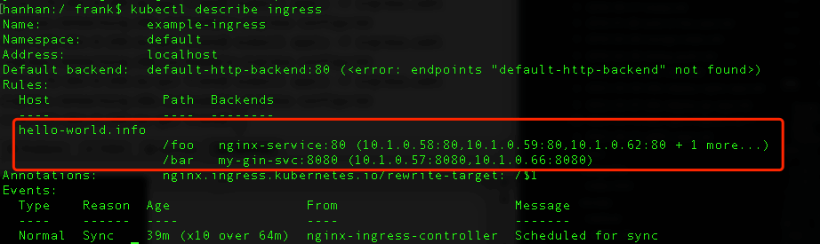

* content
{:toc}

准备工作：
参考文档中有些远程文件需要科学上网工具，我把文件down下来
镜像需要科学上网工具，国内镜像替换请自行解决

#### 前提条件
基于上两篇文章我们部署了:
- nginx-app
```
apiVersion: v1
kind: Service
metadata:
  name: nginx-service
  labels:
    app: nginx
spec:
  selector:
    app: nginx
  ports:
  - name: nginx-port
    protocol: TCP
    port: 80
    nodePort: 30000
    targetPort: 80
  type: NodePort
```  

- go-app
```
apiVersion: v1
kind: Service
metadata:
  name: my-gin-svc
  labels:
    app: my-gin
spec:
  selector:
    app: my-gin
  ports:
    - port: 8080
      protocol: TCP
      name: http-port
      targetPort: 8080
      nodePort: 30001
  type: NodePort
```

##### 检查服务情况
```
kubectl get svc
```

NAME            TYPE        CLUSTER-IP       EXTERNAL-IP   PORT(S)          AGE
kubernetes      ClusterIP   10.96.0.1        <none>        443/TCP          13d
my-gin-svc      NodePort    10.107.177.243   <none>        8080:30001/TCP   12d
nginx-service   NodePort    10.110.125.145   <none>        80:30000/TCP     12d

#### 部署 nginx-ingress controller

> 镜像拉去需要科学上网工具

新建ingress-nginx.yaml文件，内容如下
```
apiVersion: v1
kind: Namespace
metadata:
  name: ingress-nginx
  labels:
    app.kubernetes.io/name: ingress-nginx
    app.kubernetes.io/instance: ingress-nginx

---
# Source: ingress-nginx/templates/controller-serviceaccount.yaml
apiVersion: v1
kind: ServiceAccount
metadata:
  labels:
    helm.sh/chart: ingress-nginx-4.0.10
    app.kubernetes.io/name: ingress-nginx
    app.kubernetes.io/instance: ingress-nginx
    app.kubernetes.io/version: 1.1.0
    app.kubernetes.io/managed-by: Helm
    app.kubernetes.io/component: controller
  name: ingress-nginx
  namespace: ingress-nginx
automountServiceAccountToken: true
---
# Source: ingress-nginx/templates/controller-configmap.yaml
apiVersion: v1
kind: ConfigMap
metadata:
  labels:
    helm.sh/chart: ingress-nginx-4.0.10
    app.kubernetes.io/name: ingress-nginx
    app.kubernetes.io/instance: ingress-nginx
    app.kubernetes.io/version: 1.1.0
    app.kubernetes.io/managed-by: Helm
    app.kubernetes.io/component: controller
  name: ingress-nginx-controller
  namespace: ingress-nginx
data:
  allow-snippet-annotations: 'true'
---
# Source: ingress-nginx/templates/clusterrole.yaml
apiVersion: rbac.authorization.k8s.io/v1
kind: ClusterRole
metadata:
  labels:
    helm.sh/chart: ingress-nginx-4.0.10
    app.kubernetes.io/name: ingress-nginx
    app.kubernetes.io/instance: ingress-nginx
    app.kubernetes.io/version: 1.1.0
    app.kubernetes.io/managed-by: Helm
  name: ingress-nginx
rules:
  - apiGroups:
      - ''
    resources:
      - configmaps
      - endpoints
      - nodes
      - pods
      - secrets
      - namespaces
    verbs:
      - list
      - watch
  - apiGroups:
      - ''
    resources:
      - nodes
    verbs:
      - get
  - apiGroups:
      - ''
    resources:
      - services
    verbs:
      - get
      - list
      - watch
  - apiGroups:
      - networking.k8s.io
    resources:
      - ingresses
    verbs:
      - get
      - list
      - watch
  - apiGroups:
      - ''
    resources:
      - events
    verbs:
      - create
      - patch
  - apiGroups:
      - networking.k8s.io
    resources:
      - ingresses/status
    verbs:
      - update
  - apiGroups:
      - networking.k8s.io
    resources:
      - ingressclasses
    verbs:
      - get
      - list
      - watch
---
# Source: ingress-nginx/templates/clusterrolebinding.yaml
apiVersion: rbac.authorization.k8s.io/v1
kind: ClusterRoleBinding
metadata:
  labels:
    helm.sh/chart: ingress-nginx-4.0.10
    app.kubernetes.io/name: ingress-nginx
    app.kubernetes.io/instance: ingress-nginx
    app.kubernetes.io/version: 1.1.0
    app.kubernetes.io/managed-by: Helm
  name: ingress-nginx
roleRef:
  apiGroup: rbac.authorization.k8s.io
  kind: ClusterRole
  name: ingress-nginx
subjects:
  - kind: ServiceAccount
    name: ingress-nginx
    namespace: ingress-nginx
---
# Source: ingress-nginx/templates/controller-role.yaml
apiVersion: rbac.authorization.k8s.io/v1
kind: Role
metadata:
  labels:
    helm.sh/chart: ingress-nginx-4.0.10
    app.kubernetes.io/name: ingress-nginx
    app.kubernetes.io/instance: ingress-nginx
    app.kubernetes.io/version: 1.1.0
    app.kubernetes.io/managed-by: Helm
    app.kubernetes.io/component: controller
  name: ingress-nginx
  namespace: ingress-nginx
rules:
  - apiGroups:
      - ''
    resources:
      - namespaces
    verbs:
      - get
  - apiGroups:
      - ''
    resources:
      - configmaps
      - pods
      - secrets
      - endpoints
    verbs:
      - get
      - list
      - watch
  - apiGroups:
      - ''
    resources:
      - services
    verbs:
      - get
      - list
      - watch
  - apiGroups:
      - networking.k8s.io
    resources:
      - ingresses
    verbs:
      - get
      - list
      - watch
  - apiGroups:
      - networking.k8s.io
    resources:
      - ingresses/status
    verbs:
      - update
  - apiGroups:
      - networking.k8s.io
    resources:
      - ingressclasses
    verbs:
      - get
      - list
      - watch
  - apiGroups:
      - ''
    resources:
      - configmaps
    resourceNames:
      - ingress-controller-leader
    verbs:
      - get
      - update
  - apiGroups:
      - ''
    resources:
      - configmaps
    verbs:
      - create
  - apiGroups:
      - ''
    resources:
      - events
    verbs:
      - create
      - patch
---
# Source: ingress-nginx/templates/controller-rolebinding.yaml
apiVersion: rbac.authorization.k8s.io/v1
kind: RoleBinding
metadata:
  labels:
    helm.sh/chart: ingress-nginx-4.0.10
    app.kubernetes.io/name: ingress-nginx
    app.kubernetes.io/instance: ingress-nginx
    app.kubernetes.io/version: 1.1.0
    app.kubernetes.io/managed-by: Helm
    app.kubernetes.io/component: controller
  name: ingress-nginx
  namespace: ingress-nginx
roleRef:
  apiGroup: rbac.authorization.k8s.io
  kind: Role
  name: ingress-nginx
subjects:
  - kind: ServiceAccount
    name: ingress-nginx
    namespace: ingress-nginx
---
# Source: ingress-nginx/templates/controller-service-webhook.yaml
apiVersion: v1
kind: Service
metadata:
  labels:
    helm.sh/chart: ingress-nginx-4.0.10
    app.kubernetes.io/name: ingress-nginx
    app.kubernetes.io/instance: ingress-nginx
    app.kubernetes.io/version: 1.1.0
    app.kubernetes.io/managed-by: Helm
    app.kubernetes.io/component: controller
  name: ingress-nginx-controller-admission
  namespace: ingress-nginx
spec:
  type: ClusterIP
  ports:
    - name: https-webhook
      port: 443
      targetPort: webhook
      appProtocol: https
  selector:
    app.kubernetes.io/name: ingress-nginx
    app.kubernetes.io/instance: ingress-nginx
    app.kubernetes.io/component: controller
---
# Source: ingress-nginx/templates/controller-service.yaml
apiVersion: v1
kind: Service
metadata:
  annotations:
  labels:
    helm.sh/chart: ingress-nginx-4.0.10
    app.kubernetes.io/name: ingress-nginx
    app.kubernetes.io/instance: ingress-nginx
    app.kubernetes.io/version: 1.1.0
    app.kubernetes.io/managed-by: Helm
    app.kubernetes.io/component: controller
  name: ingress-nginx-controller
  namespace: ingress-nginx
spec:
  type: LoadBalancer
  externalTrafficPolicy: Local
  ipFamilyPolicy: SingleStack
  ipFamilies:
    - IPv4
  ports:
    - name: http
      port: 80
      protocol: TCP
      targetPort: http
      appProtocol: http
    - name: https
      port: 443
      protocol: TCP
      targetPort: https
      appProtocol: https
  selector:
    app.kubernetes.io/name: ingress-nginx
    app.kubernetes.io/instance: ingress-nginx
    app.kubernetes.io/component: controller
---
# Source: ingress-nginx/templates/controller-deployment.yaml
apiVersion: apps/v1
kind: Deployment
metadata:
  labels:
    helm.sh/chart: ingress-nginx-4.0.10
    app.kubernetes.io/name: ingress-nginx
    app.kubernetes.io/instance: ingress-nginx
    app.kubernetes.io/version: 1.1.0
    app.kubernetes.io/managed-by: Helm
    app.kubernetes.io/component: controller
  name: ingress-nginx-controller
  namespace: ingress-nginx
spec:
  selector:
    matchLabels:
      app.kubernetes.io/name: ingress-nginx
      app.kubernetes.io/instance: ingress-nginx
      app.kubernetes.io/component: controller
  revisionHistoryLimit: 10
  minReadySeconds: 0
  template:
    metadata:
      labels:
        app.kubernetes.io/name: ingress-nginx
        app.kubernetes.io/instance: ingress-nginx
        app.kubernetes.io/component: controller
    spec:
      dnsPolicy: ClusterFirst
      containers:
        - name: controller
          image: k8s.gcr.io/ingress-nginx/controller:v1.1.0@sha256:f766669fdcf3dc26347ed273a55e754b427eb4411ee075a53f30718b4499076a
          imagePullPolicy: IfNotPresent
          lifecycle:
            preStop:
              exec:
                command:
                  - /wait-shutdown
          args:
            - /nginx-ingress-controller
            - --publish-service=$(POD_NAMESPACE)/ingress-nginx-controller
            - --election-id=ingress-controller-leader
            - --controller-class=k8s.io/ingress-nginx
            - --configmap=$(POD_NAMESPACE)/ingress-nginx-controller
            - --validating-webhook=:8443
            - --validating-webhook-certificate=/usr/local/certificates/cert
            - --validating-webhook-key=/usr/local/certificates/key
          securityContext:
            capabilities:
              drop:
                - ALL
              add:
                - NET_BIND_SERVICE
            runAsUser: 101
            allowPrivilegeEscalation: true
          env:
            - name: POD_NAME
              valueFrom:
                fieldRef:
                  fieldPath: metadata.name
            - name: POD_NAMESPACE
              valueFrom:
                fieldRef:
                  fieldPath: metadata.namespace
            - name: LD_PRELOAD
              value: /usr/local/lib/libmimalloc.so
          livenessProbe:
            failureThreshold: 5
            httpGet:
              path: /healthz
              port: 10254
              scheme: HTTP
            initialDelaySeconds: 10
            periodSeconds: 10
            successThreshold: 1
            timeoutSeconds: 1
          readinessProbe:
            failureThreshold: 3
            httpGet:
              path: /healthz
              port: 10254
              scheme: HTTP
            initialDelaySeconds: 10
            periodSeconds: 10
            successThreshold: 1
            timeoutSeconds: 1
          ports:
            - name: http
              containerPort: 80
              protocol: TCP
            - name: https
              containerPort: 443
              protocol: TCP
            - name: webhook
              containerPort: 8443
              protocol: TCP
          volumeMounts:
            - name: webhook-cert
              mountPath: /usr/local/certificates/
              readOnly: true
          resources:
            requests:
              cpu: 100m
              memory: 90Mi
      nodeSelector:
        kubernetes.io/os: linux
      serviceAccountName: ingress-nginx
      terminationGracePeriodSeconds: 300
      volumes:
        - name: webhook-cert
          secret:
            secretName: ingress-nginx-admission
---
# Source: ingress-nginx/templates/controller-ingressclass.yaml
# We don't support namespaced ingressClass yet
# So a ClusterRole and a ClusterRoleBinding is required
apiVersion: networking.k8s.io/v1
kind: IngressClass
metadata:
  labels:
    helm.sh/chart: ingress-nginx-4.0.10
    app.kubernetes.io/name: ingress-nginx
    app.kubernetes.io/instance: ingress-nginx
    app.kubernetes.io/version: 1.1.0
    app.kubernetes.io/managed-by: Helm
    app.kubernetes.io/component: controller
  name: nginx
  namespace: ingress-nginx
spec:
  controller: k8s.io/ingress-nginx
---
# Source: ingress-nginx/templates/admission-webhooks/validating-webhook.yaml
# before changing this value, check the required kubernetes version
# https://kubernetes.io/docs/reference/access-authn-authz/extensible-admission-controllers/#prerequisites
apiVersion: admissionregistration.k8s.io/v1
kind: ValidatingWebhookConfiguration
metadata:
  labels:
    helm.sh/chart: ingress-nginx-4.0.10
    app.kubernetes.io/name: ingress-nginx
    app.kubernetes.io/instance: ingress-nginx
    app.kubernetes.io/version: 1.1.0
    app.kubernetes.io/managed-by: Helm
    app.kubernetes.io/component: admission-webhook
  name: ingress-nginx-admission
webhooks:
  - name: validate.nginx.ingress.kubernetes.io
    matchPolicy: Equivalent
    rules:
      - apiGroups:
          - networking.k8s.io
        apiVersions:
          - v1
        operations:
          - CREATE
          - UPDATE
        resources:
          - ingresses
    failurePolicy: Fail
    sideEffects: None
    admissionReviewVersions:
      - v1
    clientConfig:
      service:
        namespace: ingress-nginx
        name: ingress-nginx-controller-admission
        path: /networking/v1/ingresses
---
# Source: ingress-nginx/templates/admission-webhooks/job-patch/serviceaccount.yaml
apiVersion: v1
kind: ServiceAccount
metadata:
  name: ingress-nginx-admission
  namespace: ingress-nginx
  annotations:
    helm.sh/hook: pre-install,pre-upgrade,post-install,post-upgrade
    helm.sh/hook-delete-policy: before-hook-creation,hook-succeeded
  labels:
    helm.sh/chart: ingress-nginx-4.0.10
    app.kubernetes.io/name: ingress-nginx
    app.kubernetes.io/instance: ingress-nginx
    app.kubernetes.io/version: 1.1.0
    app.kubernetes.io/managed-by: Helm
    app.kubernetes.io/component: admission-webhook
---
# Source: ingress-nginx/templates/admission-webhooks/job-patch/clusterrole.yaml
apiVersion: rbac.authorization.k8s.io/v1
kind: ClusterRole
metadata:
  name: ingress-nginx-admission
  annotations:
    helm.sh/hook: pre-install,pre-upgrade,post-install,post-upgrade
    helm.sh/hook-delete-policy: before-hook-creation,hook-succeeded
  labels:
    helm.sh/chart: ingress-nginx-4.0.10
    app.kubernetes.io/name: ingress-nginx
    app.kubernetes.io/instance: ingress-nginx
    app.kubernetes.io/version: 1.1.0
    app.kubernetes.io/managed-by: Helm
    app.kubernetes.io/component: admission-webhook
rules:
  - apiGroups:
      - admissionregistration.k8s.io
    resources:
      - validatingwebhookconfigurations
    verbs:
      - get
      - update
---
# Source: ingress-nginx/templates/admission-webhooks/job-patch/clusterrolebinding.yaml
apiVersion: rbac.authorization.k8s.io/v1
kind: ClusterRoleBinding
metadata:
  name: ingress-nginx-admission
  annotations:
    helm.sh/hook: pre-install,pre-upgrade,post-install,post-upgrade
    helm.sh/hook-delete-policy: before-hook-creation,hook-succeeded
  labels:
    helm.sh/chart: ingress-nginx-4.0.10
    app.kubernetes.io/name: ingress-nginx
    app.kubernetes.io/instance: ingress-nginx
    app.kubernetes.io/version: 1.1.0
    app.kubernetes.io/managed-by: Helm
    app.kubernetes.io/component: admission-webhook
roleRef:
  apiGroup: rbac.authorization.k8s.io
  kind: ClusterRole
  name: ingress-nginx-admission
subjects:
  - kind: ServiceAccount
    name: ingress-nginx-admission
    namespace: ingress-nginx
---
# Source: ingress-nginx/templates/admission-webhooks/job-patch/role.yaml
apiVersion: rbac.authorization.k8s.io/v1
kind: Role
metadata:
  name: ingress-nginx-admission
  namespace: ingress-nginx
  annotations:
    helm.sh/hook: pre-install,pre-upgrade,post-install,post-upgrade
    helm.sh/hook-delete-policy: before-hook-creation,hook-succeeded
  labels:
    helm.sh/chart: ingress-nginx-4.0.10
    app.kubernetes.io/name: ingress-nginx
    app.kubernetes.io/instance: ingress-nginx
    app.kubernetes.io/version: 1.1.0
    app.kubernetes.io/managed-by: Helm
    app.kubernetes.io/component: admission-webhook
rules:
  - apiGroups:
      - ''
    resources:
      - secrets
    verbs:
      - get
      - create
---
# Source: ingress-nginx/templates/admission-webhooks/job-patch/rolebinding.yaml
apiVersion: rbac.authorization.k8s.io/v1
kind: RoleBinding
metadata:
  name: ingress-nginx-admission
  namespace: ingress-nginx
  annotations:
    helm.sh/hook: pre-install,pre-upgrade,post-install,post-upgrade
    helm.sh/hook-delete-policy: before-hook-creation,hook-succeeded
  labels:
    helm.sh/chart: ingress-nginx-4.0.10
    app.kubernetes.io/name: ingress-nginx
    app.kubernetes.io/instance: ingress-nginx
    app.kubernetes.io/version: 1.1.0
    app.kubernetes.io/managed-by: Helm
    app.kubernetes.io/component: admission-webhook
roleRef:
  apiGroup: rbac.authorization.k8s.io
  kind: Role
  name: ingress-nginx-admission
subjects:
  - kind: ServiceAccount
    name: ingress-nginx-admission
    namespace: ingress-nginx
---
# Source: ingress-nginx/templates/admission-webhooks/job-patch/job-createSecret.yaml
apiVersion: batch/v1
kind: Job
metadata:
  name: ingress-nginx-admission-create
  namespace: ingress-nginx
  annotations:
    helm.sh/hook: pre-install,pre-upgrade
    helm.sh/hook-delete-policy: before-hook-creation,hook-succeeded
  labels:
    helm.sh/chart: ingress-nginx-4.0.10
    app.kubernetes.io/name: ingress-nginx
    app.kubernetes.io/instance: ingress-nginx
    app.kubernetes.io/version: 1.1.0
    app.kubernetes.io/managed-by: Helm
    app.kubernetes.io/component: admission-webhook
spec:
  template:
    metadata:
      name: ingress-nginx-admission-create
      labels:
        helm.sh/chart: ingress-nginx-4.0.10
        app.kubernetes.io/name: ingress-nginx
        app.kubernetes.io/instance: ingress-nginx
        app.kubernetes.io/version: 1.1.0
        app.kubernetes.io/managed-by: Helm
        app.kubernetes.io/component: admission-webhook
    spec:
      containers:
        - name: create
          image: k8s.gcr.io/ingress-nginx/kube-webhook-certgen:v1.1.1@sha256:64d8c73dca984af206adf9d6d7e46aa550362b1d7a01f3a0a91b20cc67868660
          imagePullPolicy: IfNotPresent
          args:
            - create
            - --host=ingress-nginx-controller-admission,ingress-nginx-controller-admission.$(POD_NAMESPACE).svc
            - --namespace=$(POD_NAMESPACE)
            - --secret-name=ingress-nginx-admission
          env:
            - name: POD_NAMESPACE
              valueFrom:
                fieldRef:
                  fieldPath: metadata.namespace
          securityContext:
            allowPrivilegeEscalation: false
      restartPolicy: OnFailure
      serviceAccountName: ingress-nginx-admission
      nodeSelector:
        kubernetes.io/os: linux
      securityContext:
        runAsNonRoot: true
        runAsUser: 2000
---
# Source: ingress-nginx/templates/admission-webhooks/job-patch/job-patchWebhook.yaml
apiVersion: batch/v1
kind: Job
metadata:
  name: ingress-nginx-admission-patch
  namespace: ingress-nginx
  annotations:
    helm.sh/hook: post-install,post-upgrade
    helm.sh/hook-delete-policy: before-hook-creation,hook-succeeded
  labels:
    helm.sh/chart: ingress-nginx-4.0.10
    app.kubernetes.io/name: ingress-nginx
    app.kubernetes.io/instance: ingress-nginx
    app.kubernetes.io/version: 1.1.0
    app.kubernetes.io/managed-by: Helm
    app.kubernetes.io/component: admission-webhook
spec:
  template:
    metadata:
      name: ingress-nginx-admission-patch
      labels:
        helm.sh/chart: ingress-nginx-4.0.10
        app.kubernetes.io/name: ingress-nginx
        app.kubernetes.io/instance: ingress-nginx
        app.kubernetes.io/version: 1.1.0
        app.kubernetes.io/managed-by: Helm
        app.kubernetes.io/component: admission-webhook
    spec:
      containers:
        - name: patch
          image: k8s.gcr.io/ingress-nginx/kube-webhook-certgen:v1.1.1@sha256:64d8c73dca984af206adf9d6d7e46aa550362b1d7a01f3a0a91b20cc67868660
          imagePullPolicy: IfNotPresent
          args:
            - patch
            - --webhook-name=ingress-nginx-admission
            - --namespace=$(POD_NAMESPACE)
            - --patch-mutating=false
            - --secret-name=ingress-nginx-admission
            - --patch-failure-policy=Fail
          env:
            - name: POD_NAMESPACE
              valueFrom:
                fieldRef:
                  fieldPath: metadata.namespace
          securityContext:
            allowPrivilegeEscalation: false
      restartPolicy: OnFailure
      serviceAccountName: ingress-nginx-admission
      nodeSelector:
        kubernetes.io/os: linux
      securityContext:
        runAsNonRoot: true
        runAsUser: 2000
```

```
# 启动服务
kubectl apply -f ingress-nginx.yaml
```

#### 部署 ingress

新建 ingress.yaml，内容如下

```
apiVersion: networking.k8s.io/v1
kind: Ingress
metadata:
  name: example-ingress
  annotations:
    nginx.ingress.kubernetes.io/rewrite-target: /$1
spec:
  rules:
    # 访问的host
    - host: hello-world.info
      http:
        paths:
          - path: /foo # 路由到 nginx app
            pathType: Prefix
            backend:
              service:
                name: nginx-service
                port:
                  number: 80
          - path: /bar # 路由到 go app
            pathType: Prefix
            backend:
              service:
                name: my-gin-svc
                port:
                  number: 8080
```

启动服务
```
kubectl apply -f ingress.yaml
```

Tips: 使用ingress暴露服务时候，kubectl apply -f ingress.yaml 报错：

```
Error from server (InternalError): error when creating “ingress.yaml”: Internal error occurred: failed calling webhook “validate.nginx.ingress.kubernetes.io”: failed to call webhook: Post “https://ingress-nginx-controller-admission.ingress-nginx.svc:443/networking/v1/ingresses?timeout=10s”: x509: certificate has expired or is not yet valid: ...
```

解决方式：
1. 查看 kubectl apply -f ingress.yaml
```
kubectl get validatingwebhookconfigurations
```

2. 删除ingress-nginx-admission
```
kubectl delete -A ValidatingWebhookConfiguration ingress-nginx-admission
```

3. 然后再执行
```
kubectl apply -f ingress.yaml 
```

##### 查看 ingress
```
kubectl get ing
# NAME              CLASS           HOSTS              ADDRESS     PORTS   AGE
# example-ingress   ingress-nginx   hello-world.info   localhost   80      82m
```

#### 检查信息
```
kubectl describe ingress
kubectl get all -n ingress-nginx
```
可以看到代理配置相关的路由情况：


#### 通过 ingress 访问服务
```
curl hello-world.info/foo
curl hello-world.info/bar
```

#### 结语
至此我们从使用k8s部署服务，到服务的调用，负载均衡算是到一段落了，这里记录的主要是整个过程的流程跑通，其中很多基础知识都没有做详细解释和介绍，需要大家先去看看官方文档，在来实操

很多基础概念等直接读官方文档会比较靠谱，自己加以文笔怕误人子弟了，建议出门右转官网

此外还有灰度发布，流量转发等，自动伸缩...可能还需继续该系列，先到这吧

#### 参考文档
- https://kubernetes.io/docs/tasks/access-application-cluster/ingress-minikube/
- https://kubernetes.github.io/ingress-nginx/deploy/
- https://kubernetes.io/docs/concepts/services-networking/ingress/

