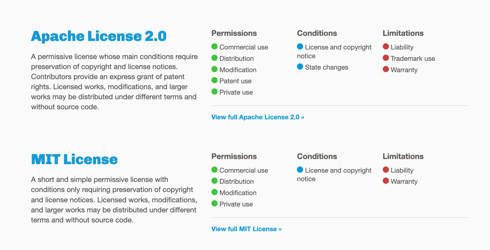

* content
{:toc}

#### 简单介绍
截图来源参考文档[1]


#### 如何使用
> 以 [Apache License 2.0](https://choosealicense.com/licenses/apache-2.0/) 为例

在源代码的根目录中创建一个文本文件（通常名为LICENSE或LICENSE.txt），并将许可证的文本复制到该文件中。

文本内容较长，都在上面的内容中，这里就不贴了，注意修改以下内容以下：

```
// ...
Copyright [yyyy] [name of copyright owner] // 这里需要修改
// ...
```

#### 其它各协议简单介绍

> 以下简介来自于不负责任的翻译理解，请阅读参考文档[2]

|  协议   | 简介  | 
|  ---   | ---  | 
|  Apache 2.0 | 允许他人修改源代码后再闭源，但是必须对每个修改过的文件做版权说明 | 
|  GNU GPLv3 | 无论以何种方式修改或者使用代码，都需要开源 | 
|  MIT   | 允许他人修改源代码后再闭源，不用对修改过的文件做说明，且二次开发的软件可以使用原作者的名字做营销  | 
|  BSD 2-Clause / BSD 3-Clause   | 和MIT类似，但未经事先书面许可，不得使用版权所有者的姓名或其贡献者的姓名来推广  | 
|  BSL  | 和GPL类似，但不需要复制版权信息  | 
|  Creative Commons Zero v1.0 Universal  | 放弃创作的作品版权权益，并将其奉献给大众，不对代码做任何担保  | 
|  EPL2.0  | 与GPL类似，有权使用、修改、复制与发布软件原始版本和修改后版本，但在某些情况下则必须将修改内容一并释出  | 

#### 简单总结

- MIT 是一个很宽松的协议，允许对代码做任何形式的修改和宣传
- GPL 鼓励免费，著名的Linux使用的就是这个协议，这使得它成为时下热门的一个协议
- BSD 不允许不经书面许可借原作者进行推广，如果介意其他人的项目推广自己的话可以选择这个协议

> 其它的参阅以下文档

#### 参考文档
1. [choosealicense](https://choosealicense.com)
2. [Licenses](https://choosealicense.com/licenses/)

