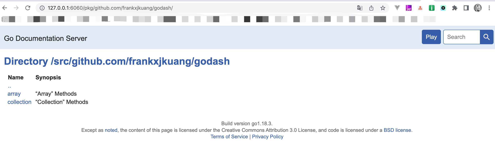
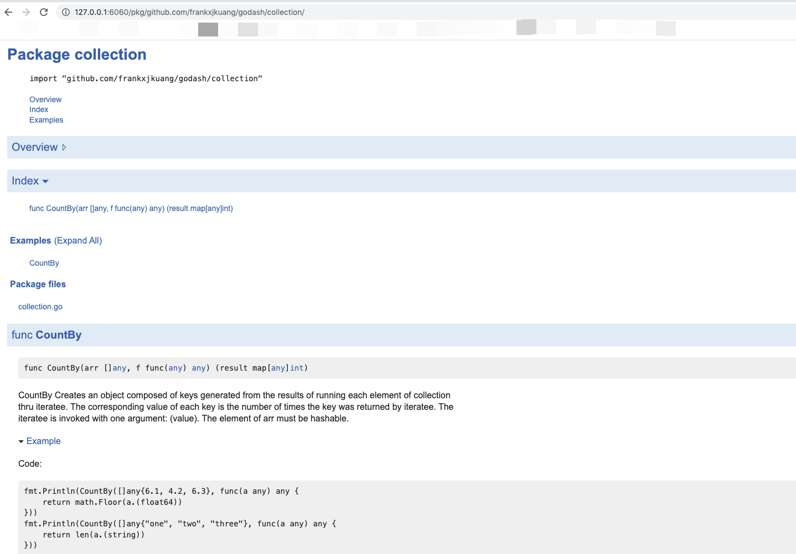
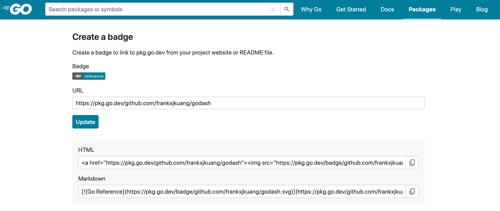

* content
{:toc}

## godoc

最近想着好玩仿照着[lodash](https://lodash.com/)做一个go版本的实现[godash](https://github.com/frankxjkuang/godash)，顺便用用[goDoc](https://golang.org/doc/)

go的官方文档已经很不错了，咱们如果开源的东西都可以直接按照goDoc的规范注释，这样就会自动生成文档，发布到github（被引用）之后会自动被收录到[https://pkg.go.dev/](https://pkg.go.dev/)

规范参考官方文档，这里不赘述了

下面是演示一下[godash](https://github.com/frankxjkuang/godash)的文档

```
# 启动文档服务
# 简短的：godoc -http=:6060 -play
godoc -http=127.0.0.1:6060 -play
```

- 访问：http://localhost:6060/pkg/就能看到golang的官方文档了，其中`Thid party`栏就是我们自己的包文档了

- 访问：http://127.0.0.1:6060/pkg/github.com/frankxjkuang/godash/就是godash项目的文档

文档截图：





本地检查文档没有问题，提交代码到[github](https://github.com/frankxjkuang/godash)

由于pkg.go.dev的同步机制，所以咱们新建一个项目：go get 一下项目，触发同步文档到pkg.go.dev

没问题就可以在以下地址访问到我们自己项目的文档了：

访问官方地址：https://pkg.go.dev/github.com/frankxjkuang/godash

## 项目示例

下面是一个示例代码:

- 项目结构
```
godash
└── collection     
    ├── collection.go
    └── collection_test.go   
```

- collection.go中实现的一个CountBy方法
```
// “Collection” Methods
package collection

// CountBy Creates an object composed of keys generated from the results of running each element of collection thru iteratee.
// The corresponding value of each key is the number of times the key was returned by iteratee.
// The iteratee is invoked with one argument: (value).
// The element of arr must be hashable.
func CountBy(arr []any, f func(any) any) (result map[any]int) {
	result = make(map[any]int)
	for i := 0; i < len(arr); i++ {
		key := f(arr[i])
		result[key]++
	}
	return result
}
```

- collection_test.go使用示例
```
func ExampleCountBy() {
	fmt.Println(CountBy([]any{6.1, 4.2, 6.3}, func(a any) any {
		return math.Floor(a.(float64))
	}))
	fmt.Println(CountBy([]any{"one", "two", "three"}, func(a any) any {
		return len(a.(string))
	}))
	// Output:
	// map[4:1 6:2]
	// map[3:2 5:1]
}

```

## 生成徽章
[徽章传送门](https://pkg.go.dev/badge)

使用项目的文档地址生成徽章，就像这样放在README文档中，像这样：

[](https://pkg.go.dev/github.com/frankxjkuang/godash)

