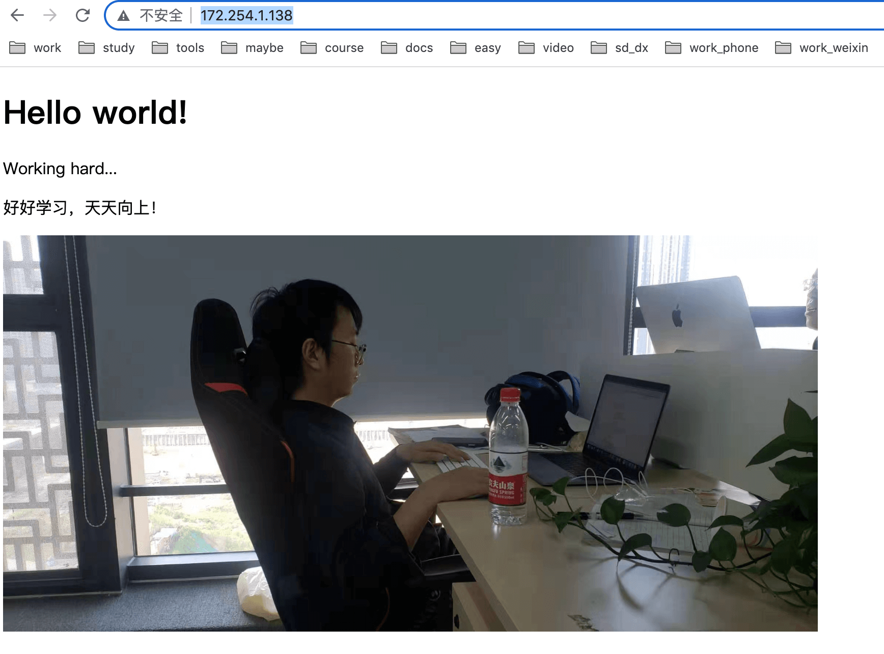
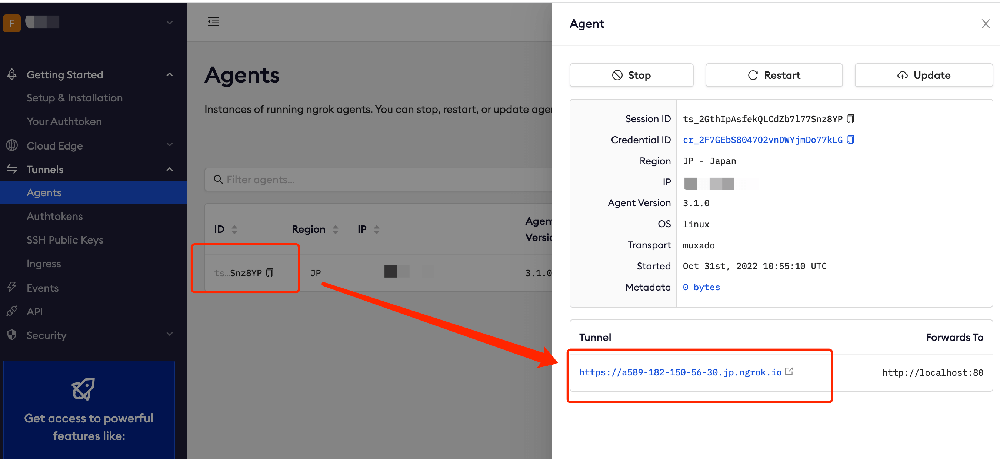
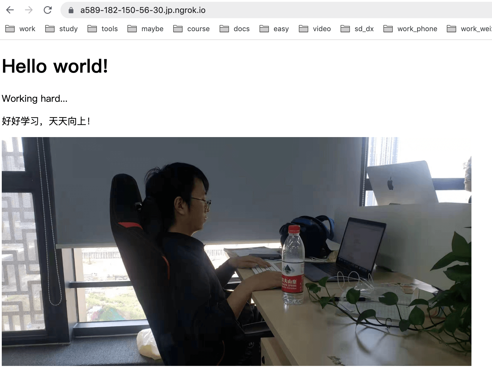

* content
{:toc}

## iPhone 上运行 Web 服务器
使用了6年的iPhone6光荣退役，闲着无用准备来玩玩，下面用来做一台Web服务器：
1. Linux shell环境
2. SSH 连接
2. 启动一个静态服务器（实现内网访问网站）
3. ngrok内网穿透（实现外网访问网站）

## Linux shell环境
在 `App Store` 下载应用 [iSH](https://github.com/ish-app)，打开之后就是一个Linux shell环境，它是alpine linux，是一个社区开发的面向安全应用的轻量级Linux发行版；下面的所有操作都是基于它实现，在页面执行 `uname -a`，可以来查看 Linux 系统信息，iSH 虚拟的是一台拥有 x86 架构的 Linux

## SSH 连接

在手机上操作非常不方便，因此我们用电脑通过ssh连接手机，在电脑终端上操作提高效率和体验；

直接github传送门：https://github.com/ish-app/ish/wiki/Running-an-SSH-server

简单来说就三步，在手机上执行：
```
// openssh
apk add openssh-server


// 修改ssh配置文件
vi /etc/ssh/sshd_config

Port 22
PermitRootLogin yes

// 重启
/etc/init.d/sshd restart
```

保证手机和电脑连接同一WiFi，查看手机Wi-Fi的ip地址：
设置 => wifi => ip
找到ip之后打开电脑终端，ssh连接

```
# 默认密码：alpine
ssh root@手机Wi-Fi的ip地址
```

注意初次登陆需要密码，参考文档：https://blog.csdn.net/zz00008888/article/details/110822536
```
password
```

使用密钥免密登陆，参考文档：https://www.jianshu.com/p/98524ef393f1
```
ssh-copy-id root@手机Wi-Fi的ip
```

ok，连接上之后我们就可以非常快乐的在电脑终端操作手机了

> 如果遇到启动报错问题：sshd re-exec requires execution with an absolute path，可以尝试下载包解决`apk add openrc`，参考文档：https://stackoverflow.com/questions/39460085/docker-alpine-images-basic-commands-are-not-working/39460146#39460146

## 启动一个静态服务器
下面是下载python3的http.server，当然也可以使用其他方式实现

```
# 开启一个静态服务
apk add python3 

# 开启本地服务
python3 -m http.server 80

# 后台运行
python3 -m http.server 80 &
```

以上相当于开启了一个80端口的静态Web服务器，通过访问手机wifi的ip地址就可以看到了；静态资源地址是`/root/website`

我们可以修改index.html文件看看效果：


## ngrok内网穿透
通过内网穿透实现外网访问我们的网站，我用的是ngrok：https://dashboard.ngrok.com

根据文档下载安装即可：https://dashboard.ngrok.com/get-started/setup

启动之后查看外网域名：


通过域名外网访问我们的静态网站：
启动之后查看外网域名：


## 总结
以上我们实现了通过外网访问在以手机为服务的静态网站，我试过其他几个内网穿透工具，由于 `iSH` 的问题，他并不是一个真正的linux系统，存在诸多问题，详见github官网的介绍；因此选择了ngrok，此外也支持ssh外网连接，感兴趣的话可以试试

此外我还尝试了安装golang环境，编译执行，由于性能有限，使用起来非常慢，不过玩玩也挺好，参考地址：https://github.com/ish-app/ish/issues/1230

```
apk add go --repository=http://dl-cdn.alpinelinux.org/alpine/latest-stable/community

# 修改go env
go env -w GO111MODULE=on
go env -w GOPROXY=https://goproxy.cn
```

## 参考文档
- alpine 系统：https://blog.csdn.net/qq_58268157/article/details/121903436
- Mac登录到iPhone：https://www.jianshu.com/p/98524ef393f1
- ngrok：https://dashboard.ngrok.com
- Compiling golang project for ish：https://github.com/ish-app/ish/issues/1230

