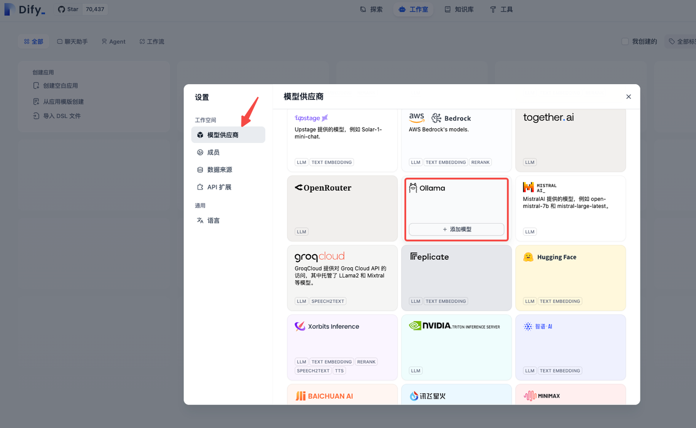
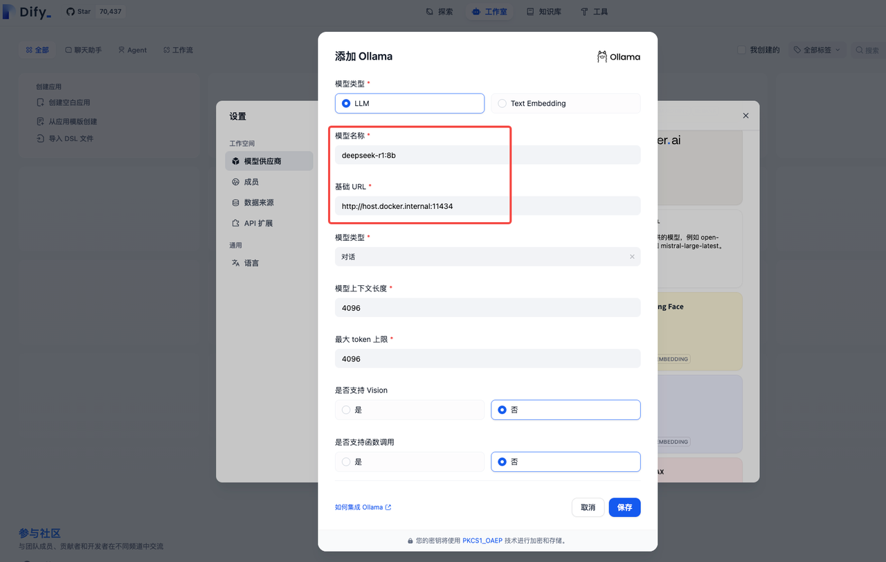
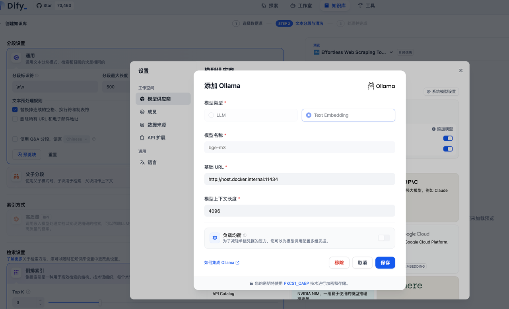
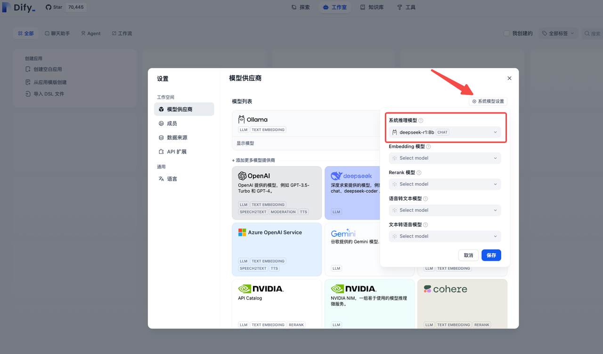
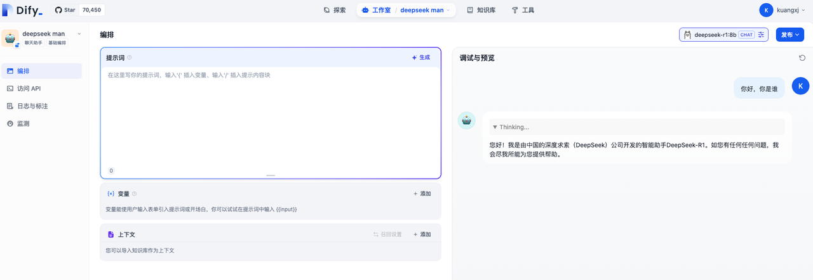
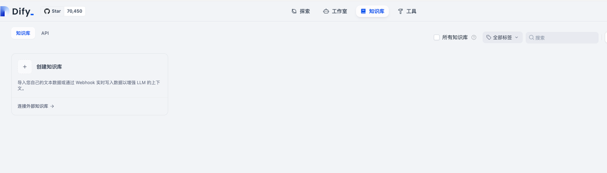
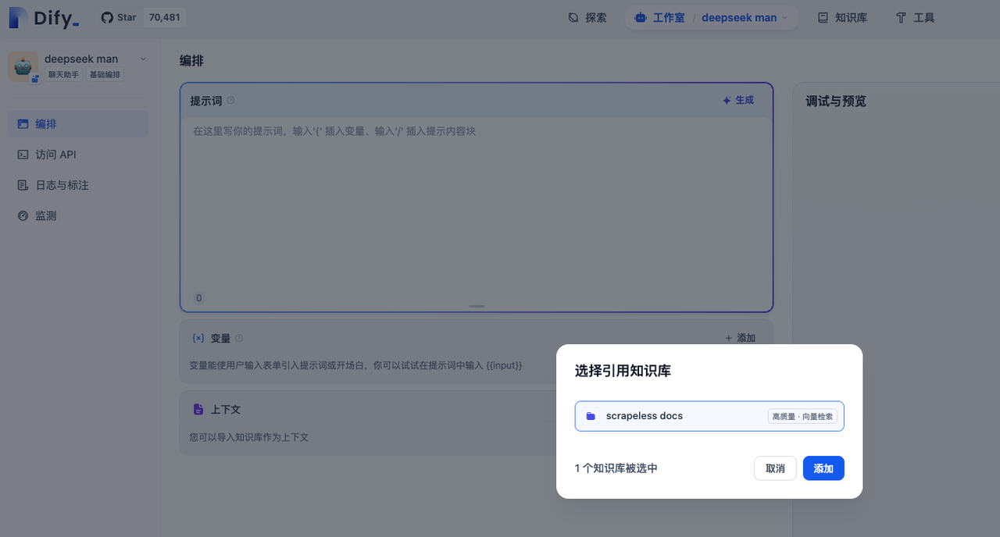
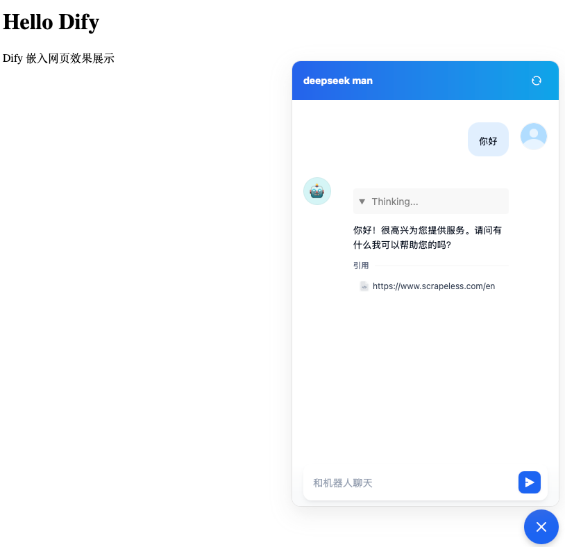
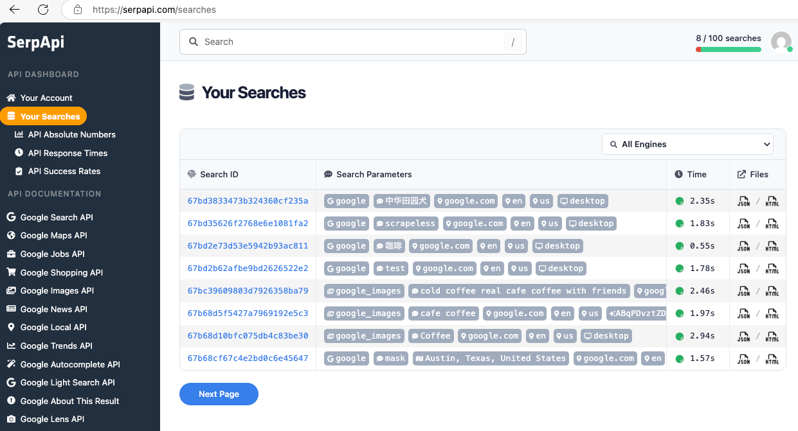

* content
{:toc}

## 搭建dify + deepseek搭建知识库
1. Dify 参考文档
  - https://dify.ai/zh
  - https://github.com/langgenius/dify

2. Deepseek 参考文档
  - https://www.deepseek.com
  - https://github.com/deepseek-ai/DeepSeek-R1

### 准备工作
1. 安装docker、docker-compose 参考文档
  - https://www.docker.com/

2. 安装ollama 参考文档
  - https://ollama.com/
  - https://github.com/ollama/ollama

```
ollama -v
# ollama version is 0.5.11
```

3. 安装deepseek-r1模型
> 把电脑配置给deepseek，让它推荐安装版本
👉  [传送门](https://ollama.com/library/deepseek-r1:8b)

```
# 有点大，4.9G，还有更大的😜
ollama run deepseek-r1:8b
```

4. 安装Embedding模型

> 搭建知识库的时候需要读取语料文件分析
>
> Embedding（嵌入）模型 是一种 将文本、图像或其他数据转换为高维向量（数值表示） 的机器学习模型。它的主要作用是 捕捉数据的语义信息，使得计算机可以理解、比较和操作数据
> 
> 计算机不能直接理解文本，它只能处理数值数据。因此，我们需要 把文本或其他非结构化数据转换成数值形式（向量），这样才能用于搜索、推荐、分类等任务    
👉 [传送门](https://ollama.com/library/bge-m3)

PS：模型安装完成之后可以检查一下
```
# 查看安装的模型
ollama list
```

5. 下载启动dify

> CPU >= 2 Core
> 
> RAM >= 4 GiB
> 
> dify本身对电脑的配置要求不高，主要是大模型要求高
> 
> 👉 [传送门](https://github.com/langgenius/dify)
```
git clone https://github.com/langgenius/dify.git
```

修改配置文件，dify用docker启动，大模型是运行在本机上，因此需要docker环境能访问到本机
```
# 进入docker 目录下
cd docker
# step1 把.env.example文件名修改为.env

# step2 在.env文件后添加如下配置
# ------------------------------
# 启用自定义模型
CUSTOM_MODEL_ENABLED=true
# 指定ollama的api地址，添加模型的时候需要用到
OLLAMA_API_BASE_URL=host.docker.internal:11434
# ------------------------------

# step 3 使用docker-compose启动服务（依赖比较多，需要等一会）
# 启动之后就可以访问dify了：http://127.0.0.1/install
docker-compose up -d
```
> PS：第一次认证的账号就是管理员

### 设置模型​
​
访问地址：http://127.0.0.1/install​

下面都是图文步骤​



准备工作中安装或者设置的配置信息


同样的添加Embedding模型


保存成功之后在系统模型设置里就能看到我们安装的模型了，注意这里保存之后需要刷新一下页面


### 创建聊天助手




### 创建知识库
参考文档：dify：create-knowledge-and-upload-documents



这里的两个网络同步工具也比较有意思，爬取网页数据生成MD文档，直接作为知识库的物料
- https://jina.ai/reader/
- https://www.firecrawl.dev/

选择知识库内容作为上下文


Tips: 最后别忘了保存更新

### 知识库嵌入网页
支持的嵌入方式
1. iframe 嵌入
2. js代码嵌入
  - 踩坑记录，参考解决：issues14077
  - 踩坑记录，新版镜像发布解决（嵌入报错 (0 , g.getPrevChatList) is not a function）：issues14279
3. Dify Chrome 浏览器扩展

选择js代码嵌入效果展示


## 探索实验Chat flow工作流
http://127.0.0.1/apps
具体流程比较简单，这里展示一下效果：基于serpapi工具的搜索结果页数据展示
这个工具是serpapi提供的，需要配置SerpApi API key，使用之后Searches会有对应的结果


## 参考文档
1. https://dify.ai/（开源）：LLM 应用开发平台。提供从 Agent 构建到 AI workflow 编排、RAG 检索、模型管理等能力，轻松构建和运营生成式 AI 原生应用
2. https://docs.dify.ai/
3. https://www.coze.com/（闭源）：下一代 AI Agent 构建平台
4. https://anythingllm.com/（开源）：全方位AI应用程序
5. https://ollama.com/：大语言模型管理工具