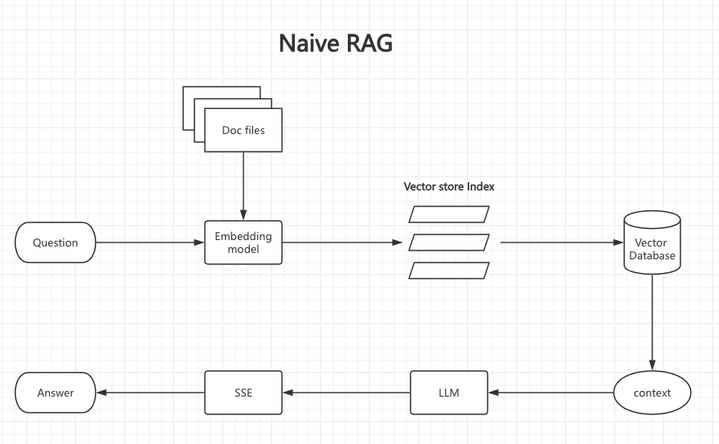

* content
{:toc}

## 基础介绍
> 检索增强生成（RAG）是指对大型语言模型输出进行优化，使其能够在生成响应之前引用训练数据来源之外的权威知识库

- 什么是RAG
- 为什么需要RAG
- RAG和LLM的关系

参考文档 传送门👉 [What is RAG](https://aws.amazon.com/what-is/retrieval-augmented-generation/)

## 依赖介绍
> 上一次我们使用Dify搭建了自己的知识库，其实这次我们要做的就是自己实现这一套

- 向量数据库：[milvus](https://github.com/milvus-io/milvus)
- 本地大模型部署工具：[ollama](https://ollama.com)
- 依赖模型：
    - LLM模型：deepseek-r1:8b
    - Embedding模型：bge-m3 
- 开发语言：golang

实现流程如下:
1. 知识库源文件Doc files通过Embedding模型将数据向量化之后存入向量数据库milvus
2. 用户提问，通过Embedding模型将问题向量化召回查询数据，将数据和问题合并上下文（优化提示词）提供给LLM大模型，最终通过SSE事件流响应给客户端




## 开发实现
> 以下是一些关键步骤的实现

### 初始化向量数据库，建立索引
```// InitDB 初始化数据库，创建collection、索引
func InitDB(ctx context.Context) error {
	cli, err := InitMilvus(ctx)
	if err != nil {
		return fmt.Errorf("failed to initialize Milvus client: %v", err)
	}
	defer cli.Close(ctx)
	has, _ := cli.HasCollection(ctx, milvusclient.NewHasCollectionOption(collectionName))
	if has {
		// 测试的时候可以删除重新创建
		log.Println("已存在同名集合，正在删除...")
		_ = cli.DropCollection(ctx, milvusclient.NewDropCollectionOption(collectionName))
		//return nil
	}

	schema := entity.NewSchema().WithDynamicFieldEnabled(true).
		WithField(entity.NewField().WithName("id").WithIsAutoID(true).WithDataType(entity.FieldTypeInt64).WithIsPrimaryKey(true)).
		WithField(entity.NewField().WithName("vector").WithDataType(entity.FieldTypeFloatVector).WithDim(int64(1024))).
		WithField(entity.NewField().WithName("text").WithDataType(entity.FieldTypeVarChar).WithMaxLength(2048)).
		WithField(entity.NewField().WithName("fileID").WithDataType(entity.FieldTypeVarChar).WithMaxLength(64)).
		WithField(entity.NewField().WithName("userID").WithDataType(entity.FieldTypeVarChar).WithMaxLength(64))
	opts := milvusclient.NewCreateCollectionOption(collectionName, schema)

	err = cli.CreateCollection(ctx, opts)
	if err != nil {
		return fmt.Errorf("failed to create collection: %v", err)
	}

	hnswIndex := index.NewHNSWIndex(entity.COSINE, 8, 200)
	createIndexOption := milvusclient.NewCreateIndexOption(collectionName, "vector", hnswIndex)

	// 创建索引
	_, err = cli.CreateIndex(context.Background(), createIndexOption)
	if err != nil {
		log.Fatal("failed to create index:", err.Error())
		return err
	}

	// 添加对 userID 字段的索引创建逻辑
	userIDIndexOption := milvusclient.NewCreateIndexOption(collectionName, "userID", index.NewInvertedIndex())
	_, err = cli.CreateIndex(context.Background(), userIDIndexOption)
	if err != nil {
		log.Fatal("failed to create index for userID field:", err.Error())
		return err
	}

	return nil
}
```

### 原始数据向量化，建立知识库
```
type processResult struct {
	filePath string
	err      error
	duration time.Duration
	workerID int
}

func ProcessDocuments() error {
	ctx := context.Background()
	err := InitDB(ctx)
	if err != nil {
		return fmt.Errorf("初始化数据库失败: %v", err)
	}

	// 配置参数
	dir := "./docs"
	userID := "default"
	maxConcurrency := runtime.NumCPU() * 2                // 根据CPU核心数动态设置并发数
	fileTypes := []string{".txt", ".md", ".pdf", ".docx"} // 支持的文件类型

	log.Printf("开始扫描文档目录: %s", dir)

	// 获取文件列表
	files, err := findFiles(dir, fileTypes)
	if err != nil {
		return fmt.Errorf("查找文件失败: %v", err)
	}

	if len(files) == 0 {
		return fmt.Errorf("未找到可处理的文件")
	}

	log.Printf("找到 %d 个文档待处理", len(files))

	// 创建处理通道和等待组
	fileChan := make(chan string, maxConcurrency)
	resultChan := make(chan processResult, len(files))
	var wg sync.WaitGroup

	// 启动工作池
	for i := 0; i < maxConcurrency; i++ {
		wg.Add(1)
		go func(workerID int) {
			defer wg.Done()
			for filePath := range fileChan {
				select {
				case <-ctx.Done():
					resultChan <- processResult{filePath: filePath, err: ctx.Err()}
					return
				default:
					start := time.Now()
					err := processSingleFile(ctx, filePath, userID, workerID)
					duration := time.Since(start)
					resultChan <- processResult{
						filePath: filePath,
						err:      err,
						duration: duration,
						workerID: workerID,
					}
				}
			}
		}(i)
	}

	// 发送文件到通道
	go func() {
		for _, file := range files {
			select {
			case fileChan <- file:
			case <-ctx.Done():
				return
			}
		}
		close(fileChan)
	}()

	// 等待所有任务完成
	go func() {
		wg.Wait()
		close(resultChan)
	}()

	// 处理结果并显示进度
	startTime := time.Now()
	processed := 0
	successes := 0
	failures := 0
	lastUpdate := time.Now()

	for result := range resultChan {
		processed++

		if result.err != nil {
			failures++
			log.Printf("[Worker %d] 处理失败: %s | 错误: %v | 耗时: %v",
				result.workerID, filepath.Base(result.filePath), result.err, result.duration.Round(time.Millisecond))
		} else {
			successes++
			log.Printf("[Worker %d] 处理成功: %s | 耗时: %v",
				result.workerID, filepath.Base(result.filePath), result.duration.Round(time.Millisecond))
		}

		// 定期更新进度
		if time.Since(lastUpdate) > 5*time.Second || processed == len(files) {
			log.Printf("进度: %d/%d (%.1f%%) | 成功: %d | 失败: %d",
				processed, len(files), float64(processed)/float64(len(files))*100,
				successes, failures)
			lastUpdate = time.Now()
		}
	}

	duration := time.Since(startTime)
	log.Printf("处理完成! 总数: %d | 成功: %d | 失败: %d | 总耗时: %v",
		len(files), successes, failures, duration.Round(time.Second))

	if failures > 0 {
		return fmt.Errorf("部分文件处理失败 (%d/%d)", failures, len(files))
	}
	return nil
}

// 查找指定类型的文件
func findFiles(dir string, extensions []string) ([]string, error) {
	var files []string
	err := filepath.Walk(dir, func(path string, info os.FileInfo, err error) error {
		if err != nil {
			log.Printf("访问路径错误: %s, 错误: %v", path, err)
			return nil // 跳过错误文件，继续处理
		}

		if !info.IsDir() {
			ext := strings.ToLower(filepath.Ext(path))
			for _, allowed := range extensions {
				if ext == allowed {
					files = append(files, path)
					break
				}
			}
		}
		return nil
	})
	return files, err
}

// 处理单个文件
func processSingleFile(ctx context.Context, filePath, userID string, workerID int) error {
	// 检查上下文是否已取消
	select {
	case <-ctx.Done():
		return ctx.Err()
	default:
	}

	// 获取文件ID (使用相对路径作为唯一ID)
	relPath, err := filepath.Rel("./docs", filePath)
	if err != nil {
		return fmt.Errorf("获取相对路径失败: %v", err)
	}
	fileID := strings.ReplaceAll(relPath, string(filepath.Separator), "_")

	// 读取文件内容
	content, err := ReadFile(filePath)
	if err != nil {
		return fmt.Errorf("读取文件失败: %v", err)
	}
	if content == "" {
		return fmt.Errorf("空文件")
	}

	// 向量化文本（带超时控制）
	vectorChan := make(chan []float32, 1)
	errChan := make(chan error, 1)

	go func() {
		vector, err := EmbedText(content)
		if err != nil {
			errChan <- err
			return
		}
		vectorChan <- vector
	}()

	select {
	case <-ctx.Done():
		return ctx.Err()
	case err := <-errChan:
		return fmt.Errorf("向量化失败: %v", err)
	case vector := <-vectorChan:
		// 存储文档
		if err := StoreDocument(fileID, userID, content, vector); err != nil {
			return fmt.Errorf("存储失败: %v", err)
		}
		return nil
	case <-time.After(2 * time.Minute): // 向量化超时时间
		return fmt.Errorf("向量化超时")
	}
}
func ReadFile(path string) (string, error) {
	// 读取文件内容
	data, err := os.ReadFile(path)
	if err != nil {
		return "", err
	}
	return string(data), nil
}
```

### 提示词优化
```
const ragPromptTemplate = `[INST] <<SYS>>
你是一个专业的知识问答助手。请根据提供的<参考信息>回答问题，严格遵守以下规则：
1. 答案必须完全基于<参考信息>内容生成
2. 如果参考信息不包含答案所需内容，必须明确说明"根据提供的信息无法回答"
3. 保持答案简洁专业，避免主观推测
4. 使用中文回答
5. 如果问题与参考信息无关，直接说明无法回答
<</SYS>>

# 参考信息：
{{.Context}}

# 用户问题：
{{.Question}}

请根据以上参考信息回答用户问题。[/INST]
`
```

### 前端SSE实现主要依赖EventSource
```
// 创建一个 EventSource 对象来接收 SSE 流
const eventSource = new EventSource(`/ask?userID=${encodeURIComponent(userID)}&query=${encodeURIComponent(query)}`);

// 监听消息事件
eventSource.onmessage = function(event) {}

// 监听错误事件
eventSource.onerror = function(event) {}
```

## 总结实现
> 理想化的RAG实现流程正如上面的流程图，简单明了，但是具体实现以及企业级生产落地还需要面临很多问题
1. 不同格式文件的处理（PDF,Word,EPUB,MarkDown等）
2. 语音搜索和混合搜索，在有大量文档的情况下，语义相似的匹配结果太多了；用户可能想要最新的信息，而不仅仅是语义最相似的信息；丢失了文档中与搜索相关的重要结构信息，例如标题、页码等.
3. 分块Chunking：向量数据库需要将文档分割成块，以便检索和生成提示.根据文档的分块方式，相同的查询将返回不同的内容.
4. 多模态：图片、音视频等等
